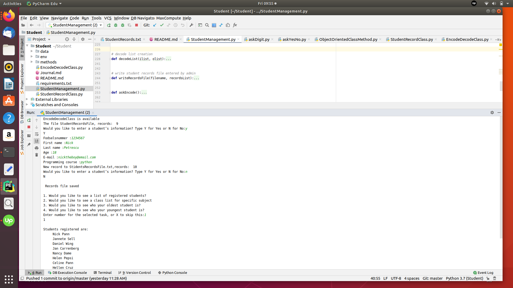

#  Tutor project      (on development)

## Learning Python on the go
Simple project for regular python code knowledge test

## Files list:

- *StudentManagement.py* - ask options, write file, encode/decode data
- *StudentRecordClass.py* - class definition of project data
- *EncodeDecodeClass.py* - project data with encoded/decoded data
- *Student_configurator.py* - create *.ini file with config data

## Main module

The main file for your project file should be call
**StudentManagement.py**.  
This is where you will write your general program structures and call
other classes from. It will be the main prompt. All of your logic code
should be in a main() method.

Each students record should fill a single line in the
**StudentRecords.txt** file . The students record should follow the
below format in the text file:

    *fodselsNummer,firstName,lastName,age,email,programmingCourse*

## StudentRecordsClass module

To create and store the student you should implement a **Student class**
called **StudentRecordClass** . The StudentRecordClass should be able to
store the following information: *- fodselsNummer* *- firstName* *-
lastName* *- age* *- email* *- programmingCourse*

It should also have a function called **DisplayName()**. The DisplayName
function should print the students full name i.e. First Name (Peter)
Last name (Pan) should print out: Peter Pan. The **StudentRecordClass**
class should be saved in its own **.py** file.

## EncodetRecordsClass module

The EncodeRecords code requires the creation of a separate class. Call
the instance of this new class within **StudentManagement.py** as
necessary. This code should be created in a separate
**EncodeDecodeClass**. In a separate .py file called
**EncodeDecodeClass.py**.

## Utilities

**Student_config.py**    - congigParser module
**/conf** - config data
**/data** - project data

